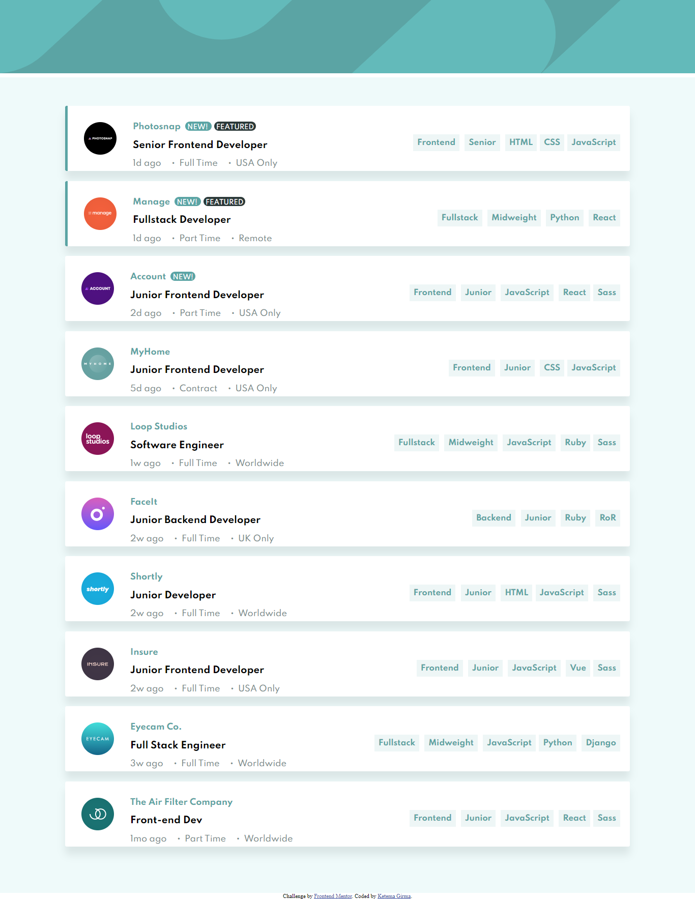

# Frontend Mentor - Job listings with filtering solution

This is a solution to the [Job listings with filtering challenge on Frontend Mentor](https://www.frontendmentor.io/challenges/job-listings-with-filtering-ivstIPCt). Frontend Mentor challenges help you improve your coding skills by building realistic projects. 

## Table of contents

- [Overview](#overview)
  - [The challenge](#the-challenge)
  - [Screenshot](#screenshot)
  - [Links](#links)
- [My process](#my-process)
  - [Built with](#built-with)
- [Author](#author)

### The challenge
Sunnyside agency landing page solution

### Screenshot

### Links

- Solution URL: https://github.com/Ketema741/FrontEnd-static-Job-Listings-Master.git
- Live Site URL: https://ketema741.github.io/FrontEnd-static-Job-Listings-Master/

### Built with
- HTML5 
- CSS 
- js template

## Author

- linkedin - [Ketema Girma](https://www.linkedin.com/in/ketema-girma-608729228/)
- Frontend Mentor - [@Ketema741](https://www.frontendmentor.io/profile/Ketema741)
- Twitter - [@KetemaGirma3](https://www.twitter.com/KetemaGirma3)
